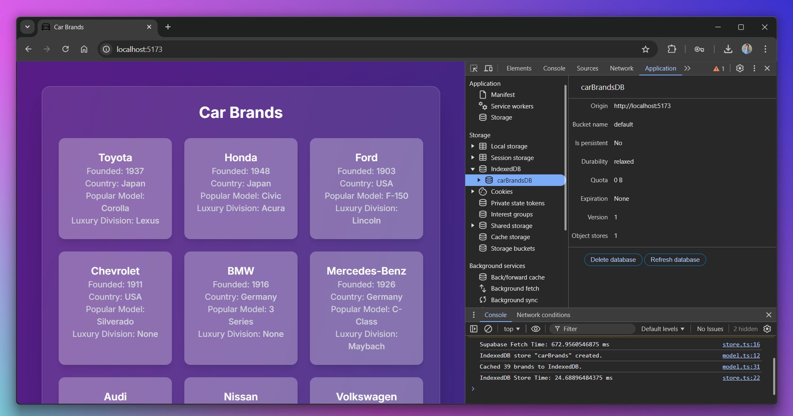
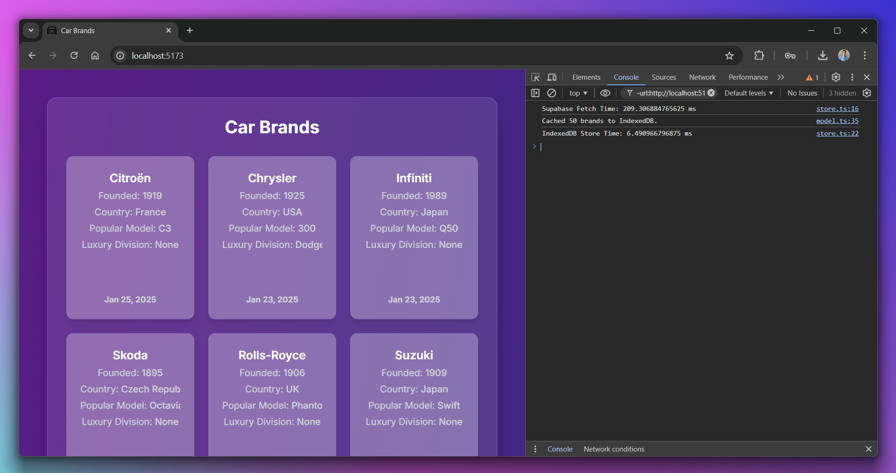

# Car Brands App

A minimalistic and efficient **React + Zustand + Supabase + IndexedDB** app to display and cache car brands data.

## Why IndexedDB?

I always relied on **Local Storage** and **Session Storage** for temporary data storage, but then I wondered—_why on earth would I use IndexedDB?_ The result shocked me!

Unlike Local Storage, **IndexedDB is a fully-featured NoSQL database** built into the browser, allowing you to:

- **Store large amounts of structured data** (up to hundreds of MBs per domain, compared to Local Storage’s 5MB limit).
- **Work offline seamlessly** by persisting API data for future use.
- **Handle complex queries** using indexes, unlike the key-value-only approach in Local Storage.
- **Improve performance** by avoiding frequent API calls and reducing backend load.
- **Use transactions** to ensure data integrity, making it ideal for apps that modify data locally.

IndexedDB is supported in **all modern browsers** and is a **game-changer** for web apps that need **offline-first functionality** or handle **large datasets efficiently**.

## Features

- **Fetches Car Brands** from **Supabase**
- **Offline Support** using **IndexedDB**
- **State Management** via **Zustand**
- **Fast & Modern Frontend** powered by **Vite**
- **Responsive UI** using **TailwindCSS**

---

## Screenshots


---

## Tech Stack

- [React](https://react.dev/) – UI Framework
- [Vite](https://vitejs.dev/) – Build Tool
- [Zustand](https://github.com/pmndrs/zustand) – State Management
- [Supabase](https://supabase.com/) – Database & API
- [IndexedDB](https://developer.mozilla.org/en-US/docs/Web/API/IndexedDB_API) – Offline Storage
- [TailwindCSS](https://tailwindcss.com/) – Styling

---

## Setup & Installation

### Clone the Repository

```sh
git clone https://github.com/kulembetov/car-brands.git
cd car-brands
```

### Install Dependencies

```sh
npm install
```

### Set Up Supabase

- Create a [Supabase](https://supabase.com/) project.
- Create a **`brands` table**:
  ```sql
  CREATE TABLE brands (
      id SERIAL PRIMARY KEY,
      brand_name TEXT NOT NULL,
      country TEXT,
      founded INT,
      popular_model TEXT,
      luxury_division TEXT,
      created_at DATE
  );
  ```
- **Add Supabase Credentials** in `.env`:
  ```sh
  VITE_SUPABASE_URL=your_supabase_url
  VITE_SUPABASE_ANON_KEY=your_supabase_anon_key
  ```

### Start Development Server

```sh
npm run dev
```

> Open **`http://localhost:5173`** in your browser.

---

## Usage Guide

### Online Mode (Supabase Fetch)

1. The app **fetches car brands from Supabase**.
2. **Caches the data in IndexedDB** for offline use.
3. Data is displayed in a **responsive grid**.

### Offline Mode (IndexedDB Fetch)

1. **Turn off the internet** (`DevTools → Network → Offline`).
2. Reload the app.
3. **Data loads instantly from IndexedDB**.

---

## Project Structure

```
car-brands/
│── public/                  # Static assets (e.g., logo)
│── src/                     # Main source code
│   │── app/                 # App-wide configurations
│   │── assets/              # Images for README
│   │── entities/brand/      # Business logic (API, Zustand, IndexedDB)
│   │── features/brand-list/ # UI for displaying brands
│   │── pages/               # Page components
│   │── App.tsx              # Main App component
│   │── main.tsx             # App entry point
│── index.css                # Global Styles
│── .gitignore               # Git ignore rules
│── .env.example             # Environment variables
│── package.json             # Dependencies & scripts
│── tsconfig.json            # TypeScript configuration
│── vite.config.ts           # Vite configuration
│── README.md                # Project documentation
```

---

## Performance Testing

### Measure Fetch Time

Check **console logs** to compare Supabase and IndexedDB speeds:

```
Supabase Fetch Time: 209ms
IndexedDB Store Time: 6ms
```

IndexedDB significantly improves offline performance.

---

## License

This project is licensed under the **MIT License**.

---

## Contributing

Feel free to **fork** this repository, submit **issues**, or open a **pull request**.

```
If you found this project helpful, consider giving it a star on GitHub!
```
